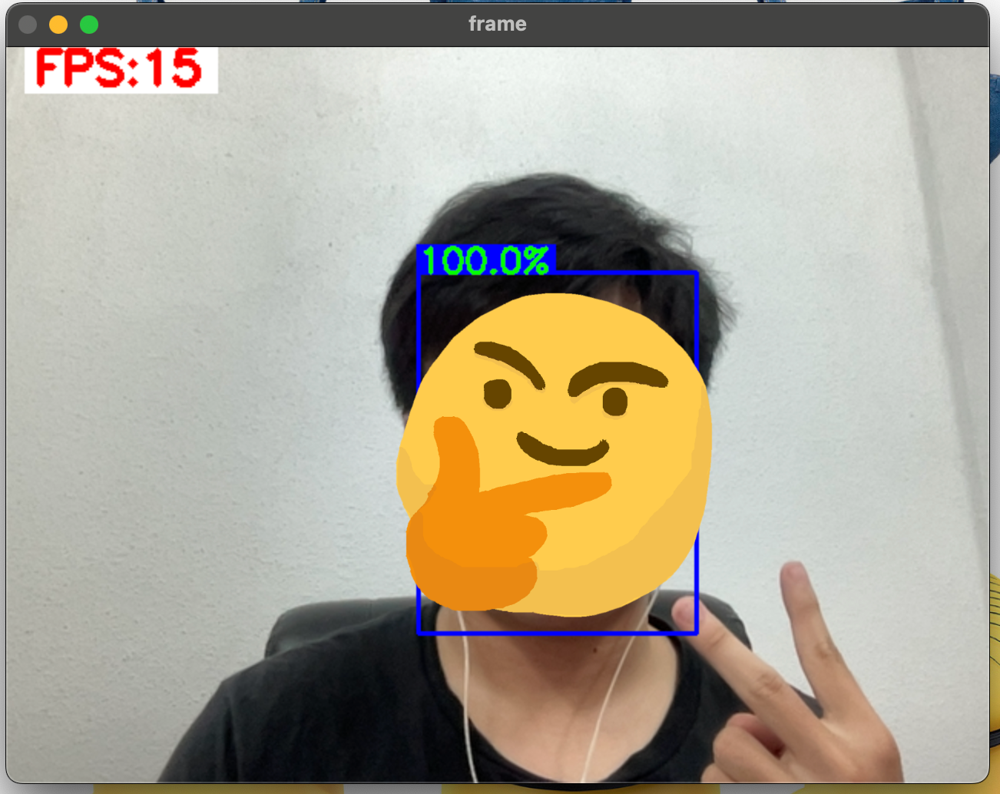

# Real time face recognition

Detect and recognize face in realtime.

# Demo



# Run local

Expect `Python >= 3.10`

1. Install dependencies
```
pip install -r requirements.txt
```

2. Prepare data

There are two options

* Manually creating `facebank` data as:
```
/facebank
├── /name1
│   ├── *.jpg
└── /name2
    ├── *.jpg
```

* Get faces from webcam by running:

```
python make_data.py
```

3. Create `face embedding` & train a classifier

Create face embedding for each image in the dataset. **Expect 1 face each images**. Embedding from `ArcFace` is a vector `(1,512)`.
```
python make_identifier.py
```

4. Inference

Run the following command for details information:

```
python main.py --help
```

* `-t` tag for task, `img` for inference on image, `vid` for inference on video.

* `-p` path to the image file.

* `-s` save the image/video after processing.

# Run API

## Run on local
```
bash run_api.sh
```

## Docker
1. Build the container
```
bash build.sh
```
2. Run the container
```
bash run.sh
```
3. Run API
```
bash run_api.sh
```