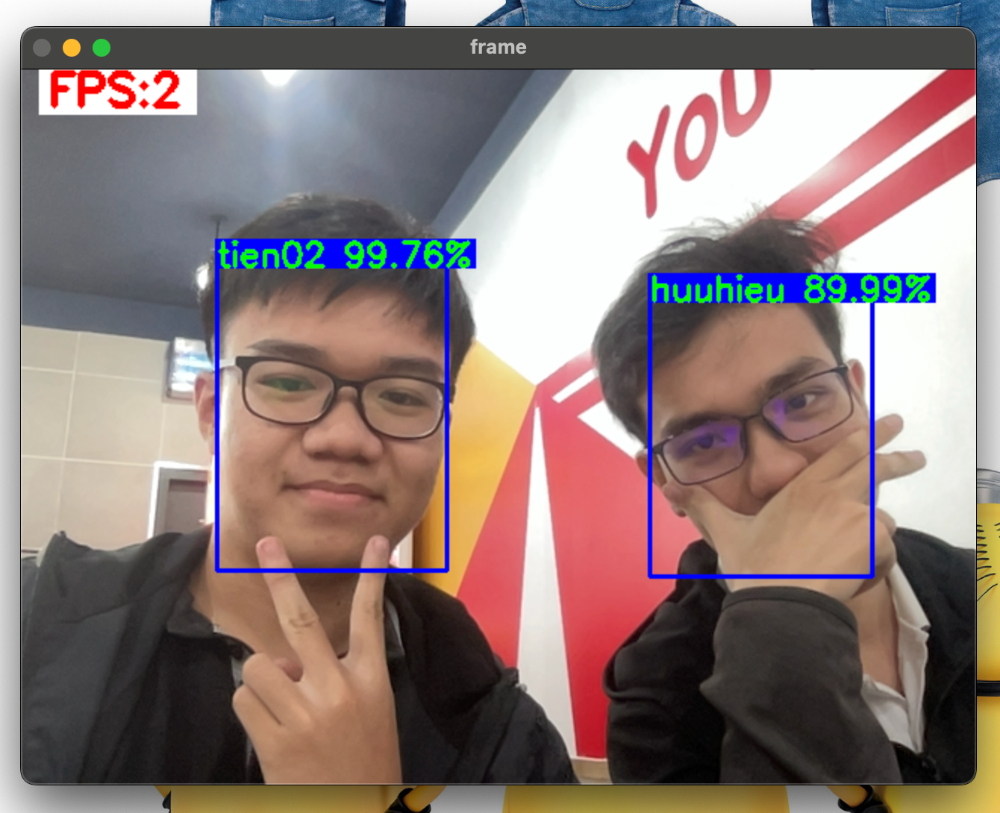

# Real time face recognition

Detect and recognize face in realtime.

Best FPS achieved around is 15 - 18.

**TO DO:**

* ~~Add threading to capture video from webcam~~

* ~~Prettify FPS, Bounding Box draw~~

* Face recognition in realtime

* Experiment with TorchScript, ONNX Runtime

* Demo web-base application

* Containerize with Docker

# Demo



# Run code

Expect `Python >= 3.10`

1. Install dependencies
```
pip install -r requirements.txt
```

2. Run code
```
bash run.sh
```